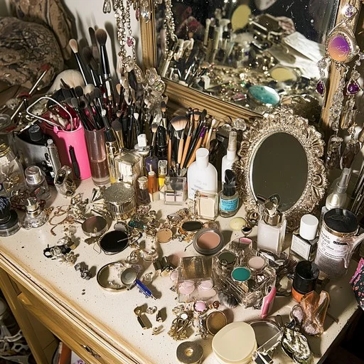

# Final project for the Building AI course

## Summary

To those who have never had the time or opportunity to learn and use makeup methods and products suitable for them, to utilize AI for inputting and recognizing facial information from human faces, and by drawing from various online beauty Youtubers's makeup recommendations and techniques, to provide customers with suitable makeup looks, as well as compatible products and methods. 

## Background

The problem I want to solve is how to enable every girl to find products and makeup looks that suit her in the shortest time and the lowest cost. Makeup is something that girls will do for relatively important occasions, so what kind of makeup look, or what products can achieve the desired makeup effect, is something that girls need to spend time searching and learning about. My wife is someone who doesn't know much about makeup, but every time i see her trying different ones, and i feel that the cosmetics she buys are not very suitable for her face, every time i see her dejectedly removing her makeup, i really want to help her find a makeup look that suits her, along with techniques and steps as well as product recommendations for her, so that she won't spend too much time and energy searching for this information. 

This is how you make a list, if you need one:
* problem 1 Doesn't know which products suit customer's skin type
* problem 2 Doesn't know which methods can help customer's makeup look better without any problems. 
* etc.

## How is it used?

For example. you know there's a party in the next few days, and you want to design a brand new makeup style for this party, so you input the style you want, and the system already has your skin information saved ( oily skin, dry skin, large pores, etc.). The system will automatically search for makeup looks that suit your skin type and requirements. After you select a makeup look, the system will recommend makeup steps and products based on your skin type. If you don't have the products, it will show you the fastest online and offline channels to purchase them, along with prices. Another usage scenario is when you want to try a new makeup look but don't know which one suits you; the system will recommend makeup looks that suit you and are different from previous ones, based on the makeup products you own and your facial information, along with makeup steps and techniques.

    
   <em>Figure 1. Example of a cluttered makeup table</em>

# Sample Python code to represent AI Makeup App data
# We use dictionaries for structured data, with lists where appropriate (mimicking the image's lists)

# 1. User Profile and facial Data (one user example; in a real app, this would be per-user)
user_profile = {
    'skin_type': 'oily', # e.g., 'oily', 'dry', 'combination'
    'skin_condition': ['large pores', 'acne-prone']
    'skin_tone': 'medium',
    'undertone': 'warm',
    'facial_features': {
        'face_shape': 'oval',
        'eye_shape': 'almond',
        'lip_shape': 'full',
     },
     'age_range': '25-35',
     'preferences': ['natural', 'glamorous for balls'],
     'owned_products': [ 'Maybelline Fit Me Foundation - Shade 220', 'NYX Lipstick - Red'],
     'ALLERGIES': ['parabens', 'fragrance'],}

# 2. Makeup Looks and Techniques Database (list of dicts, like parallel lists but more detailed)
makeup_looks = [
    {
        'id': 1,
        'name': 'Natural Glow',
        'occasion': 'daily',
        'style': 'dewy',
        'suitability': ['dry skin', 'medium tone'],
        'steps':[
            'Apply moisturizer as base.' ,
            'Use light foundation for even coverage.' ,
            'Add blush on cheeks.' ,
            'Finish with mascara and lip balm.' ,
      ],
      'time_estimate': '10 minutes',
      'variations': {'oily skin': 'Use powder foundation instead of cream.'},
   },
   {
         'id': 2,
         'name': 'Smoky Eyes for Ball',
         'occasion': 'formal',
         'style': 'bold',
         'suitability': ['oily skin', 'warm undertone'],
         'steps: [
             'Prime eyelids.' ,
             'Apply dark eyeshadow and blend.' ,
             'Line eyes with kohl.' ,
             'Add highlighter on cheekbones.' ,
             ],
             'time_estimate': '20 minutes',
             'variations': {'sensitive skin': 'Use hypoallergenic products.'},
   },
   # Add more looks as needed...
]
# 3. Product Database (list of dicts for catalog; parallel to 'fishers' list in image)
products = [
    {
         'name': 'Maybelline Fit Me Foundation',
         'brand': 'Maybelline',
         'category': 'foundation',
         'ingredients': ['water', 'dimethicone', 'no parabens'],
         'shades': [ '220 - Natural Beige', '310 - Warm Honet'],
         'suitability': [ 'oily skin', 'medium tone'],
         'price': 10.99,
         'availability': {
             'online': {'url': 'amazon.com/maybelline-fit-me', 'delivery': '2 days'},
             'offline': { 'store': 'Walmart', 'location': 'nearby'},
             },
             'ratings': 4.5,
      },
      {
          'name': 'NYX Matte Lipstick',
          'brand': 'NYX',
          'category': 'lipstick',
          'ingredients': [ 'beeswax', 'vitamin E'],
          'shades': [ 'Red', 'Nude'],
          'suitability': [ 'dry skin', 'warm undertone'],
          'price': 5.99,
          'availability':{
               'online': { 'url': 'sephora.com/nyx-lipstick', 'delivery': 'same day'},
               'offline': { 'store': 'Ultra', 'location': 'local mall'},
               },
               'ratings': 4.2,
      },
   # Add more products...
]

# 4. External and Reference Data ( Dictionary for sources; could be lists if simpler)
external_sources = {
     'beauty_bloggers': [
         { 'name': 'Influencer1', 'platform':
'Instagram', 'recommendations': ['Smoky eyes tutorial']}
         { 'name': 'Influencer2', 'platform': 'Youtube', 'recommendations': [ 'Skin tone matching' ]}
      ],
      'trends': ['dewy skin for summer', 'bold lips for 2025'],
      'ai_database': [ 'CelebA for facial recognition'],
      'market_reports': {'source': 'Statista', 'data': 'Popular foundations in US'},
      }

      # Example usage: Similar to the loop in the image, filter and print recommendations
      # (Mimicking the percentage calculation, but here filtering products for a user)
      compatible_products = []
      for product in products:
          if user_profile[ 'skin_type'] in
      products[ 'suitability'] and not any( allergy in product ['suitability'] and not any( allergy in product[ 'ingredients'] for allergy in user_profile[ 'allergies']):

      compatible_products.append (product[ 'name'])

      print( "Recommended products for user:",
      compatible_products)

      # In a real app, you'd add AI logic ( e.g., using libraries like scikit-learn for recommendations)

## Data sources and AI methods

Facial Recognition and Makeup Datasets:
      FFHQ-Makeup(from Hugging Face)
      CelebA ( Celebrity Faces Attributes Dataset )
      Cosmetic Product Image Dataset ( From Kaggle )
Product and Review Data:
      Beauty Product Catalogs ( e.g., from Sephora, Ulta, or Amazon APIs )
      Open Beauty Facts or Yelp Datasets
Beauty Trend and Expert Content:
      Social media and Blogger Sources ( e.g., Instagram, YouTube, Reddit)
      LAION-5B Aesthetic Dataset
      Dove's Real Beauty Prompt Playbook
General Public Repositories:
      Papers with COde Datasets, Hugging Face Datasets, or Open Data on AWS: For broader access to beauty-related data, like skin analysis from medical sources.
      Specialized Sources: Haut.AI or Neutrogena Skin360 datasets for skin health scoring, often derived from user selfies.
AI Tools:
Facial Recognition and Analysis:
      OpenCV or MediaPipe
      DeepFace or Trueface.ai
      MiniCPM-V
Recommendation and Personalization Systems:
      Scikit-learn or TensorFlow/PyTorch
      Weaviate
      Gemini 2.5 Flash or GPT-4o
AR and Virtual Try-on:
      YouCam Virtual Makeup Filter SDK
      ModiFace or Banuba
      Leonardo AI
Other supporting tools:
      Elysia Platform
      Stable Diffusion or Magnific AI

      
## Challenges

Although this AI makeup app can help users quickly find suitable makeup looks and products, it is limited by the accuracy of complex skin analysis, insufficient diversity, and real-time interaction capabilities, while also facing ethical issues such as data privacy leaks, algorithmic biases, and reinforcing unrealistic beauty standards.

## What next?

How could your project grow and become something even more? What kind of skills, what kind of assistance would you  need to move on? 

Focus on building a robust MVP using tools like Lovable for rapid prototyping, then expand through user acquisition strategies such as AI-driven content marketing and partnerships with beauty brands, while securing funding via accelerators or investors; i will need skills in AI/ML, app development, UI/UX design, and busines acumen like growth hacking, plus external help from mentors in tech startus, co-funders for marketing, and resources like incubators or communities on platforms.

## Acknowledgments
[makeup](https://stockcake.com/i/cluttered-makeup-table_1229998_383128)
